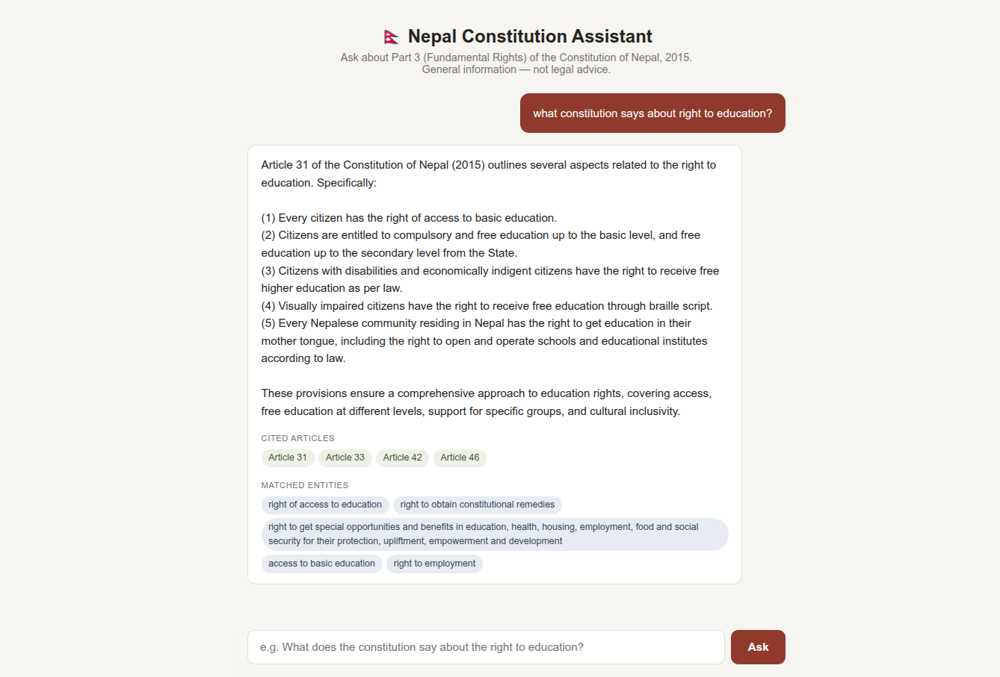

# Nepal Constitution Assistant (GraphRAG)

Ask questions about the Constitution of Nepal (2015) and get answers
grounded in actual articles — powered by **GraphRAG**: retrieval over a
knowledge graph instead of plain document search.

> "Can a citizen be denied education based on caste?"
> → traverses: (Right to Education) —[GUARANTEED_BY]→ (Article 31),
>   (Caste Discrimination) —[PROHIBITED_BY]→ (Article 24)

## Demo



## Why GraphRAG?

Classic RAG retrieves text chunks by similarity. Constitutional questions
often need *connected* facts: a right, its article, its exceptions, and
related rights. A knowledge graph stores these links explicitly and
retrieval follows them.

## How it works

1. **Ingestion (once):** an LLM reads constitutional articles and extracts
   entities + relationships (triples) into Neo4j.
2. **Query (per request):**
   - Embed the question (nomic-embed-text)
   - Vector-match it to graph nodes
   - Traverse 2 hops to collect a relevant subgraph
   - qwen2.5 answers using that subgraph, citing articles

## Quick start

**Prerequisites:** Docker, Python 3.11+, [Ollama](https://ollama.com)

```bash
# 1. Environment
cp .env.example .env          # set NEO4J_USER / NEO4J_PASSWORD
pip install -r requirements.txt

# 2. Services
docker compose up -d          # Neo4j (with APOC)
ollama pull qwen2.5:7b
ollama pull nomic-embed-text

# 3. Data pipeline (one-time)
python scripts/fetch_constitution.py <url-or-path-to-pdf>
python -m scripts.ingest      # LLM extracts the knowledge graph
python -m scripts.embed_nodes # embed entities + build vector index

# 4. Run
uvicorn app.main:app --reload
```

Open <http://localhost:8000> for the web UI, or ask via the API:

```bash
curl -X POST http://localhost:8000/ask \
  -H "Content-Type: application/json" \
  -d '{"question": "Can a citizen be denied education based on caste?"}'
```

## Project structure

```text
app/
  main.py            # FastAPI app, serves frontend + API
  api/routes.py      # POST /ask endpoint
  core/config.py     # settings (.env)
  services/          # graph, retriever, llm
frontend/index.html  # single-page web UI
scripts/             # fetch → ingest → embed pipeline
docs/images/         # screenshots used in this README
data/                # raw PDF + per-article markdown
```

## Scope

Starts with **Part 3 — Fundamental Rights (Articles 16–48)**.
Designed to expand to the full constitution.

## Stack

Neo4j 5 (graph + vector index) · Ollama (qwen2.5, nomic-embed-text) ·
LangChain · FastAPI · Docker

## Disclaimer

Educational project — not legal advice.

## Status

V1.0 Completed.
